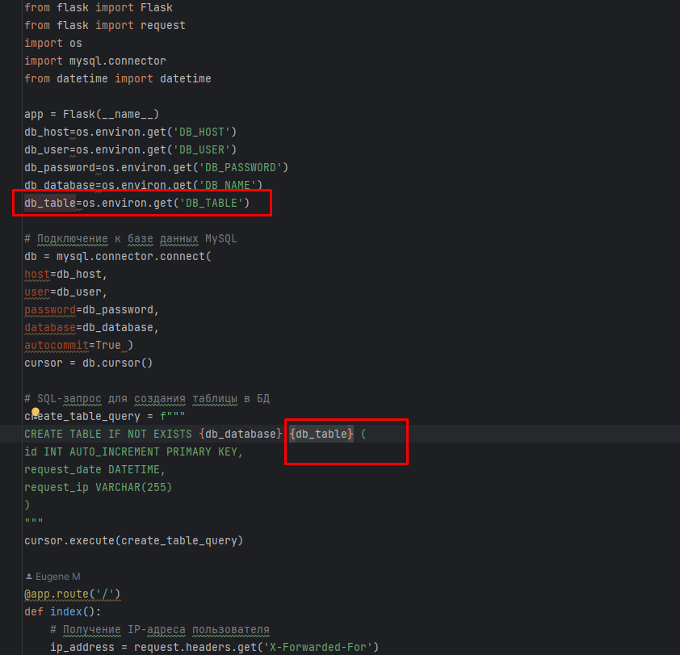

Задание 1.

1.Сделайте в своем github пространстве fork репозитория https://github.com/netology-code/shvirtd-example-python/blob/main/README.md.

✔
-

2.Создайте файл с именем Dockerfile.python для сборки данного проекта. Используйте базовый образ python:3.9-slim. Протестируйте корректность сборки. Не забудьте dockerignore.

✔
-

3.(Необязательная часть, *) Изучите инструкцию в проекте и запустите web-приложение без использования docker в venv. (Mysql БД можно запустить в docker run).

✔
-

- поднял контейнер с MySQL

- запустил виртуальную среду venv

- Прописал порт в коде и объявил переменные для коннекта бд

- Запуск

4.(Необязательная часть, *) По образцу предоставленного python кода внесите в него исправление для управления названием используемой таблицы через ENV переменную.

✔
-

