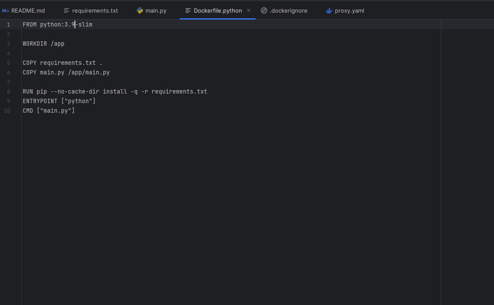

**Задание 2**

1.Сделайте в своем github пространстве fork репозитория https://github.com/netology-code/shvirtd-example-python/blob/main/README.md.

✔
-

2.Создайте файл с именем Dockerfile.python для сборки данного проекта. Используйте базовый образ python:3.9-slim. Протестируйте корректность сборки. Не забудьте dockerignore.

✔
-

3.(Необязательная часть, *) Изучите инструкцию в проекте и запустите web-приложение без использования docker в venv. (Mysql БД можно запустить в docker run).

✔
-

- поднял контейнер с MySQL

- запустил виртуальную среду venv

- Прописал порт в коде и объявил переменные для коннекта бд

- Запуск

4.(Необязательная часть, *) По образцу предоставленного python кода внесите в него исправление для управления названием используемой таблицы через ENV переменную.

✔
-

**Задание 2**

**Задание 3**

✔
-

1. Создайте файл compose.yaml. Опишите в нем следующие сервисы:
- web. Образ приложения должен ИЛИ собираться при запуске compose из файла Dockerfile.python ИЛИ скачиваться из yandex cloud container registry(из задание №2 со *). Контейнер должен работать в bridge-сети с названием backend и иметь фиксированный ipv4-адрес 172.20.0.5. Сервис должен всегда перезапускаться в случае ошибок. Передайте необходимые ENV-переменные для подключения к Mysql базе данных по сетевому имени сервиса web

- db. image=mysql:8. Контейнер должен работать в bridge-сети с названием backend и иметь фиксированный ipv4-адрес 172.20.0.10. Явно перезапуск сервиса в случае ошибок. Передайте необходимые ENV-переменные для создания: пароля root пользователя, создания базы данных, пользователя и пароля для web-приложения.Обязательно используйте .env file для назначения секретных ENV-переменных!

2. Запустите проект локально с помощью docker compose , добейтесь его стабильной работы.Протестируйте приложение с помощью команд curl -L http://127.0.0.1:8080 и curl -L http://127.0.0.1:8090.

3. Подключитесь к БД mysql с помощью команды docker exec <имя_контейнера> mysql -uroot -p<пароль root-пользователя> . Введите последовательно команды (не забываем в конце символ ; ): show databases; use <имя вашей базы данных(по-умолчанию example)>; show tables; SELECT * from requests LIMIT 10;.

4. Остановите проект. В качестве ответа приложите скриншот sql-запроса.
