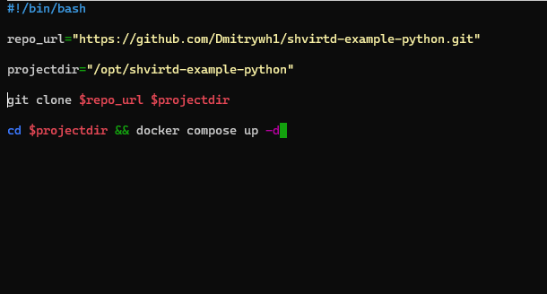

**Задание 1**

1.Сделайте в своем github пространстве fork репозитория https://github.com/netology-code/shvirtd-example-python/blob/main/README.md.

2.Создайте файл с именем Dockerfile.python для сборки данного проекта. Используйте базовый образ python:3.9-slim. Протестируйте корректность сборки. Не забудьте dockerignore.

3.(Необязательная часть, *) Изучите инструкцию в проекте и запустите web-приложение без использования docker в venv. (Mysql БД можно запустить в docker run).

- поднял контейнер с MySQL

- запустил виртуальную среду venv

- Прописал порт в коде и объявил переменные для коннекта бд

- Запуск

4.(Необязательная часть, *) По образцу предоставленного python кода внесите в него исправление для управления названием используемой таблицы через ENV переменную.

**Задание 2**

**Задание 3**

1. Создайте файл compose.yaml. Опишите в нем следующие сервисы:
- web. Образ приложения должен ИЛИ собираться при запуске compose из файла Dockerfile.python ИЛИ скачиваться из yandex cloud container registry(из задание №2 со *). Контейнер должен работать в bridge-сети с названием backend и иметь фиксированный ipv4-адрес 172.20.0.5. Сервис должен всегда перезапускаться в случае ошибок. Передайте необходимые ENV-переменные для подключения к Mysql базе данных по сетевому имени сервиса web

- db. image=mysql:8. Контейнер должен работать в bridge-сети с названием backend и иметь фиксированный ipv4-адрес 172.20.0.10. Явно перезапуск сервиса в случае ошибок. Передайте необходимые ENV-переменные для создания: пароля root пользователя, создания базы данных, пользователя и пароля для web-приложения.Обязательно используйте .env file для назначения секретных ENV-переменных!

2. Запустите проект локально с помощью docker compose , добейтесь его стабильной работы.Протестируйте приложение с помощью команд curl -L http://127.0.0.1:8080 и curl -L http://127.0.0.1:8090.

3. Подключитесь к БД mysql с помощью команды docker exec <имя_контейнера> mysql -uroot -p<пароль root-пользователя> . Введите последовательно команды (не забываем в конце символ ; ): show databases; use <имя вашей базы данных(по-умолчанию example)>; show tables; SELECT * from requests LIMIT 10;.

4. Остановите проект. В качестве ответа приложите скриншот sql-запроса.

**Задание 4**

1. Запустите в Yandex Cloud ВМ (вам хватит 2 Гб Ram).
2. Подключитесь к Вм по ssh и установите docker.
3. Напишите bash-скрипт, который скачает ваш fork-репозиторий в каталог /opt и запустит проект целиком.
- 
4. Зайдите на сайт проверки http подключений, например(или аналогичный): https://check-host.net/check-http и запустите проверку вашего сервиса http://<внешний_IP-адрес_вашей_ВМ>:5000.
5. (Необязательная часть) Дополнительно настройте remote ssh context к вашему серверу. Отобразите список контекстов и результат удаленного выполнения docker ps -a
- 
6. В качестве ответа повторите sql-запрос и приложите скриншот с данного сервера, bash-скрипт и ссылку на fork-репозиторий.
- 
- https://github.com/Dmitrywh1/shvirtd-example-python/tree/main

**Задание 5**

1. Напишите и задеплойте на вашу облачную ВМ bash скрипт, который произведет резервное копирование БД mysql в директорию "/opt/backup" с помощью запуска в сети "backend" контейнера из образа schnitzler/mysqldump при помощи docker run ... команды. Подсказка: "документация образа."
2. Протестируйте ручной запуск
3. Настройте выполнение скрипта раз в 1 минуту через cron, crontab или systemctl timer.
4. Предоставьте скрипт, cron-task и скриншот с несколькими резервными копиями в "/opt/backup"

**Задание 6**

1. Скачайте docker образ hashicorp/terraform:latest и скопируйте бинарный файл /bin/terraform на свою локальную машину, используя dive и docker save. Предоставьте скриншоты действий .

**Задание 6.1**

1. Добейтесь аналогичного результата, используя познания CMD, ENTRYPOINT и docker cp.
Предоставьте скриншоты действий.

**Задание 6.2**

1. Предложите способ извлечь файл из контейнера, используя только команду docker build и любой Dockerfile.
Предоставьте скриншоты действий .

**Задание 7**

1. Запустите ваше python-приложение с помощью runC, не используя docker или containerd.
Предоставьте скриншоты действий.
 

